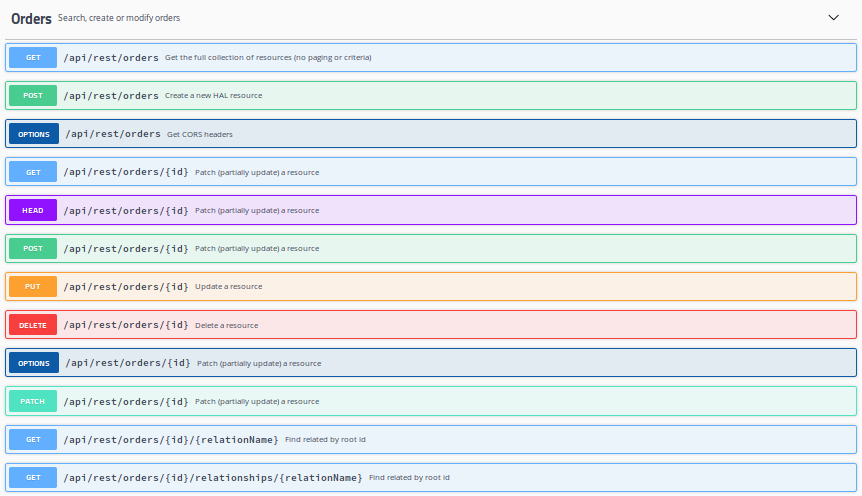

For each `ScrudBean` like the `Order` entity in the previous chapter, ScrudBeans will generate a number of 
components and expose a RESTful services for SCRUD: Search, Create, Update and Delete.

## Default Endpoints

Method | Path    | Description
------ | ------- | -------------------
GET    | /api/rest/orders/{id} | Fetch the order matching the id
GET    | /api/rest/orders/{id}/relationships/{relation} | Fetch the related object for the order matching the id
GET    | /api/rest/orders?email=%25startsWith | Search based on model properties using simple name-value pairs as URL query string parameters (paged)
GET    | /api/rest/orders?filter=createdDate=ge=2018-12-10T00:00;createdDate=le=2018-12-10T23:59:59 | Search based on model properties using an [RSQL or FIQL](https://manosbatsis.github.io/scrudbeans/docs/rsqlsupport) filter (paged)
GET    | /api/rest/orders?page=no | Get all orders
POST   | /api/rest/orders      | Create a new order
PUT    | /api/rest/orders/{id} | Update the order matching the id
PATCH  | /api/rest/orders/{id} | Partially update the order matching the id
DELETE | /api/rest/orders/{id} | Delete the order matching the id
<!--- GET    | /api/rest/orders/jsonschema | Get the JSONSchema for orders -->

Most endpoints support `application/json`, `application/hal+json` and `application/vnd.api+json`.
If you are using the scrudbeans-template, you can inspect the endpoints by starting Spring Boot 
with `./mvnw spring-boot:run` and pointing your browser to http://localhost:8080/swagger-ui.html



## Error Responses

	> The `scrudbeans-error` module is a lightweight dependency that can be used for enabling RESTful errors in any Spring Boot project.

ScrudBeans will automatically handle any exception by creating an appropriate RESTful HTTP response.
It will also automatically perform validation based on Java Bean Validation (`javax.validation`) before persisting 
or updating an entity and provide meaningful messages in such a response as necessary. For example, consider the 
following entity field:

```java
@NotNull
@Column(nullable = false, unique = true)
private String code;
```

A `null` value will result in the following response:

```json
{
    "title": "Validation failed",
    "httpStatusCode": 400,
    "requestMethod": "POST",
    "requestUrl": "/api/rest/discountCodes",
    "validationErrors": [
        {
            "message": "must not be null",
            "propertyPath": "percentage"
        }
    ],
    "remoteAddress": "127.0.0.1",
    "userAgent": "Apache-HttpClient/4.5.6 (Java/1.8.0_181)"
}

```

Similarly, a non-unique value will result in the following response:

```json
{
    "title": "Validation failed",
    "httpStatusCode": 400,
    "requestMethod": "POST",
    "requestUrl": "/api/rest/discountCodes",
    "validationErrors": [
        {
            "message": "Unique value not available for property: code",
            "propertyPath": "code"
        }
    ],
    "remoteAddress": "127.0.0.1",
    "userAgent": "Apache-HttpClient/4.5.6 (Java/1.8.0_181)"
}
```
